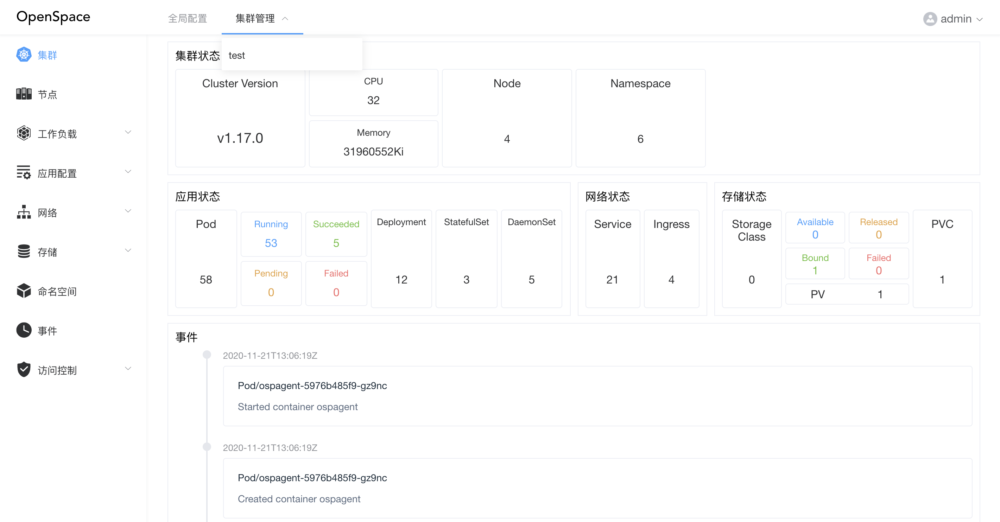
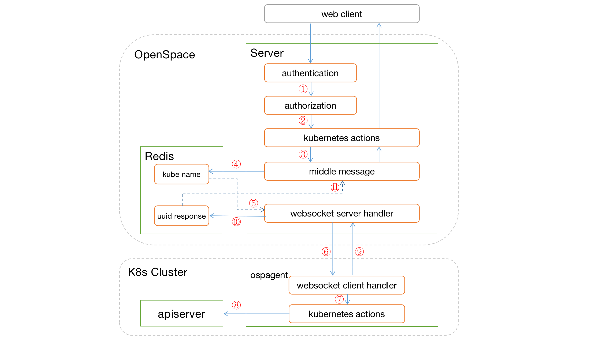

# OpenSpace

OpenSpace是一个用来管理多Kubernetes集群的开源项目。OpenSpace可以兼容不同云厂商的Kubernetes集群，极大的方便了集群的管理工作。

### 快速开始

```
sudo docker run -d --restart=unless-stopped -p 443:443 -v /root/data:/var/lib/redis --name openspace openspacee/osp
```

启动之后，在浏览器打开：https://${ip}，请将ip替换为启动服务所在服务器ip地址。

### 使用说明

#### 1. 首次登录

在OpenSpace第一次登录时，会要求输入admin超级管理员的密码，然后以admin帐号登录。


#### 2. 添加集群

首次登录之后，需要添加集群，输入集群名称，该名称在OpenSpace系统中只是作显示之用。


集群添加之后，会提示将Kubernetes集群导入连接到OpenSpace系统。


#### 3. 导入集群

在Kubernetes集群中使用上述的kubectl命令部署ospagent服务，将集群连接导入到OpenSpace系统。


等待几分钟后，查看ospagent服务是否启动。

> kubectl get all -n osp


可以看到ospagent服务的pod已经是Running状态。

#### 4. 集群管理

将Kubernetes集群成功连接导入到OpenSpace系统之后，就可以统一管理集群中的资源了。



### 软件架构




### 后续功能

- [ ] 1.界面持续优化迭代，整体操作更简单易用；
- [ ] 2.增加用户权限管理；
- [ ] 3.增加K8s资源添加及修改操作；
- [ ] 4.增加**工作台**功能，包括项目管理及CI/CD流程等；
- [ ] 5.增加支持Helm包管理工具；
- [ ] 6.增加支持添加监控功能。

### 交流讨论

如果您在使用过程中，有任何问题、建议或功能需求，可以随时在[issues](https://github.com/openspacee/osp/issues)中提交请求，我们会及时跟进。

欢迎随时跟我们交流，可以使用QQ扫描下面二维码，加入我们的QQ交流群。


最后，不要忘了点个star，支持一下😊！

### License
Copyright 2020 OpenSpace.

Licensed under the Apache License, Version 2.0 (the "License"); you may not use this file except in compliance with the License. You may obtain a copy of the License at

http://www.apache.org/licenses/LICENSE-2.0

Unless required by applicable law or agreed to in writing, software distributed under the License is distributed on an "AS IS" BASIS, WITHOUT WARRANTIES OR CONDITIONS OF ANY KIND, either express or implied. See the License for the specific language governing permissions and limitations under the License.
